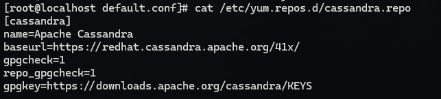
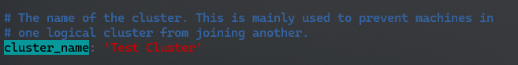
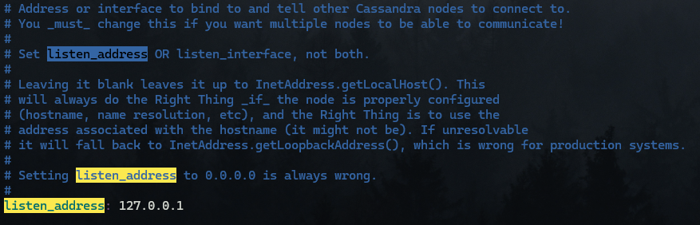
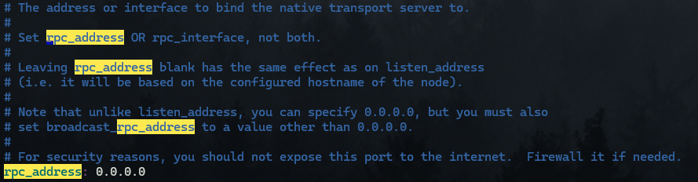
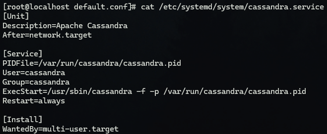
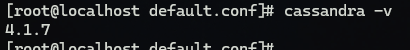
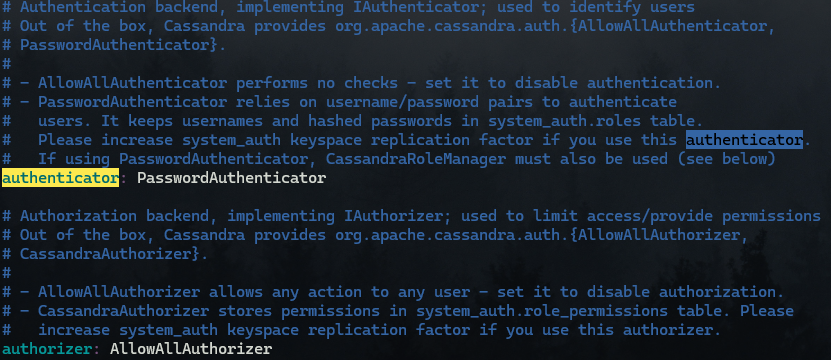

Berikut adalah langkah-langkah untuk menginstall Apache Cassandra di Rocky Linux 9.4, beserta persiapan dan prasyaratnya:

---

## **Prasyarat**
1. **Akses Root atau Sudo**: Pastikan Anda memiliki akses root atau pengguna dengan hak sudo.
2. **Java (JDK 8 atau 11)**:
   Cassandra memerlukan Java Development Kit (JDK). Instal versi JDK yang kompatibel:
   ```bash
   sudo dnf install java-11-openjdk -y
   ```
3. **Update Sistem**:
   Pastikan sistem Anda diperbarui.
   ```bash
   sudo dnf update -y
   ```
4. **Firewall**: Pastikan port berikut dibuka:
   - 7000: Internal communication
   - 7001: SSL communication (optional)
   - 9042: CQL native transport (client communication)
   - 9160: Thrift protocol (deprecated but may be used in older versions)

   Buka port dengan:
   ```bash
   sudo firewall-cmd --add-port=7000/tcp --permanent
   sudo firewall-cmd --add-port=7001/tcp --permanent
   sudo firewall-cmd --add-port=9042/tcp --permanent
   sudo firewall-cmd --add-port=9160/tcp --permanent
   sudo firewall-cmd --reload
   ```
   
---

## **Langkah Instalasi**
### 1. **Tambahkan Repository Apache Cassandra**
   Tambahkan file repo Cassandra ke direktori `/etc/yum.repos.d/`:
   ```bash
    sudo tee /etc/yum.repos.d/cassandra.repo <<EOF
    [cassandra]
    name=Apache Cassandra
    baseurl=https://redhat.cassandra.apache.org/41x/
    gpgcheck=1
    repo_gpgcheck=1
    gpgkey=https://downloads.apache.org/cassandra/KEYS
    EOF
   ```
   

### 2. **Instal Apache Cassandra**
   Setelah repository ditambahkan, instal Cassandra:
   ```bash
   sudo dnf install cassandra -y
   ```

### 3. **Konfigurasi Cassandra**
   File konfigurasi utama Cassandra ada di `/etc/cassandra/default.conf/cassandra.yaml`. Anda dapat mengedit parameter seperti:
   - **cluster_name**: Nama kluster Cassandra.
   

   - **listen_address**: IP server.
   

   - **rpc_address**: IP untuk komunikasi dengan klien.
   

   Contoh pengeditan:
   ```bash
   sudo nano /etc/cassandra/default.conf/cassandra.yaml
   ```

### 4. **Mulai dan Aktifkan Layanan Cassandra**
   Jalankan dan aktifkan Cassandra agar otomatis berjalan saat boot:
   ```bash
   sudo systemctl start cassandra
   sudo systemctl enable cassandra
   ```

### 5. **Verifikasi Instalasi**
   Untuk memeriksa apakah Cassandra berjalan:
   ```bash
   nodetool status
   ```

---

#### **Buat File Unit Systemd untuk Cassandra**
Jika file unit systemd Cassandra tidak ada, Anda bisa membuatnya secara manual. Berikut adalah contoh file unit systemd untuk Cassandra:

1. **Buat File Unit Cassandra:**
   Buat file baru di `/etc/systemd/system/cassandra.service`:
   ```bash
   sudo nano /etc/systemd/system/cassandra.service
   ```

2. **Masukkan Konfigurasi Berikut:**
   Salin dan tempel konfigurasi berikut ke dalam file:
   ```ini
    [Unit]
    Description=Apache Cassandra
    After=network.target

    [Service]
    PIDFile=/var/run/cassandra/cassandra.pid
    User=cassandra
    Group=cassandra
    ExecStart=/usr/sbin/cassandra -f -p /var/run/cassandra/cassandra.pid
    Restart=always

    [Install]
    WantedBy=multi-user.target
   ```
   

3. **Reload Systemd dan Mulai Layanan:**
   Setelah file unit Cassandra dibuat, reload systemd dan mulai layanan Cassandra:
   ```bash
   sudo systemctl daemon-reload
   sudo systemctl start cassandra
   sudo systemctl enable cassandra

---

### **Instalasi Modul yang Hilang**
   `cqlshlib` adalah bagian dari Cassandra, tetapi jika ada masalah dengan instalasi, Anda bisa mencoba untuk menginstal ulang paket Python yang dibutuhkan. Untuk memperbaikinya, coba instal ulang paket Cassandra dan dependensinya dengan perintah berikut:

   Pada distribusi berbasis Red Hat (seperti CentOS atau RHEL):
   ```bash
   sudo dnf install python3-cqlsh 
   ```

   Jika menggunakan Python 2, coba:
   ```bash
   sudo dnf install python2-cqlsh
   ```

---

Jika perintah `sudo dnf install python3-cqlsh` gagal karena paket `python3-cqlsh` tidak ditemukan, ada beberapa langkah yang bisa Anda coba untuk mengatasi masalah ini:

### 1. **Install Paket yang Diperlukan dari Repositori Cassandra**
   `cqlsh` biasanya sudah disertakan dalam paket Cassandra yang diinstal. Jika Anda mendapatkan error seperti itu, pastikan Anda sudah menginstal paket-paket yang diperlukan untuk Cassandra dengan benar. Anda bisa mencoba menginstal kembali paket Cassandra:

   ```bash
   sudo dnf install cassandra
   ```

   Jika sudah terinstal, coba periksa apakah modul Python lainnya tersedia, dengan menggunakan perintah:
   ```bash
   sudo dnf search cassandra
   ```

### 2. **Instalasi Paket dengan PIP**
   Jika masalahnya terkait dengan Python dan modul `cqlshlib`, Anda bisa mencoba menginstal ulang modul-modul terkait dengan menggunakan `pip`. Pertama, pastikan `pip` sudah terinstal:
   ```bash
   sudo dnf install python3-pip
   ```

   Setelah itu, coba instal `cassandra-driver` dengan pip:
   ```bash
   sudo pip3 install cassandra-driver
   ```

   Ini akan menginstal driver Cassandra untuk Python 3, yang juga termasuk modul-modul yang diperlukan untuk menjalankan `cqlsh`.

### 3. **Cek Versi Cassandra**
   Pastikan bahwa versi Cassandra yang terinstal di sistem Anda adalah versi yang kompatibel dengan `cqlsh`. Beberapa versi lama dari Cassandra mungkin tidak menyertakan modul `cqlshlib` atau perlu konfigurasi manual. Untuk memeriksa versi Cassandra, gunakan perintah:
   ```bash
   cassandra -v
   ```
   

---

Untuk membuat pengguna database, menetapkan kata sandi, dan membuat nama database di Cassandra menggunakan `cqlsh`, Anda bisa mengikuti langkah-langkah berikut:

---

### 1. **Masuk ke `cqlsh`**
   Jalankan perintah berikut untuk masuk ke antarmuka Cassandra Query Language Shell (CQLSH):
   ```bash
   cqlsh
   ```

---

### 2. **Aktifkan Otentikasi**
   Jika otentikasi tidak diaktifkan, Anda perlu mengaktifkannya di file konfigurasi Cassandra (`cassandra.yaml`). Cari parameter `authenticator` dan ubah nilainya menjadi `PasswordAuthenticator`:

   ```yaml
   authenticator: PasswordAuthenticator
   ```
   

   Setelah itu, restart Cassandra:
   ```bash
   sudo systemctl restart cassandra
   ```

---

### 3. **Login sebagai Superuser**
   Masuk ke `cqlsh` dengan kredensial default superuser (`cassandra` adalah username dan password default):
   ```bash
   cqlsh -u cassandra -p cassandra
   ```

---

### 4. **Buat Pengguna Baru**
   Gunakan perintah `CREATE USER` untuk membuat pengguna baru dengan nama pengguna, kata sandi, dan tingkat izin tertentu. Contohnya:
   ```sql
   CREATE USER new_user WITH PASSWORD 'new_password' NOSUPERUSER;
   ```

   **Penjelasan:**
   - `new_user`: Nama pengguna yang ingin Anda buat.
   - `new_password`: Kata sandi untuk pengguna tersebut.
   - `NOSUPERUSER`: Membuat pengguna tanpa hak superuser. Jika ingin memberikan hak superuser, gunakan `SUPERUSER`.

---

### 5. **Buat Nama Database (Keyspace)**
   Gunakan perintah `CREATE KEYSPACE` untuk membuat keyspace (nama database):
   ```sql
   CREATE KEYSPACE new_keyspace
   WITH replication = {'class': 'SimpleStrategy', 'replication_factor': 1};
   ```

   **Penjelasan:**
   - `new_keyspace`: Nama database yang ingin Anda buat.
   - `SimpleStrategy`: Strategi replikasi. Cocok untuk pengujian lokal atau cluster kecil.
   - `replication_factor`: Jumlah replika data yang disimpan.

---

### 6. **Beri Izin pada Pengguna**
   Gunakan perintah `GRANT` untuk memberikan izin pengguna pada keyspace tertentu:
   ```sql
   GRANT ALL PERMISSIONS ON KEYSPACE new_keyspace TO new_user;
   ```

   **Penjelasan:**
   - `ALL PERMISSIONS`: Memberikan semua izin (Anda juga bisa spesifik seperti `SELECT`, `MODIFY`, `CREATE`, dll.).
   - `new_keyspace`: Nama keyspace (database).
   - `new_user`: Nama pengguna.

---

### Contoh Lengkap:
Berikut adalah skrip contoh untuk membuat pengguna, keyspace, dan memberikan izin:

```sql
CREATE USER myuser WITH PASSWORD 'mypassword' NOSUPERUSER;

CREATE KEYSPACE mydatabase
WITH replication = {'class': 'SimpleStrategy', 'replication_factor': 1};

GRANT ALL PERMISSIONS ON KEYSPACE mydatabase TO myuser;
```

---

Setelah selesai, pengguna `myuser` sekarang dapat digunakan untuk mengakses keyspace `mydatabase` dengan kata sandi `mypassword`. Anda bisa login dengan:
```bash
cqlsh -u myuser -p mypassword
```

---

## **Tips dan Troubleshooting**
1. **Java Version Mismatch**: Pastikan JDK versi 8 atau 11 yang digunakan. Gunakan `java -version` untuk memverifikasi.
2. **Log File**: Jika Cassandra tidak berjalan, periksa log di `/var/log/cassandra/system.log`.
3. **Cluster Configuration**: Untuk instalasi multi-node, pastikan parameter `seed` dan `listen_address` diatur dengan benar pada setiap node.

Dengan langkah ini, Cassandra siap digunakan di Rocky Linux 9.4! 🚀